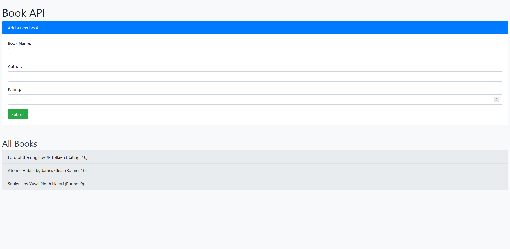

# Book API

This project leverages the power of Spring Boot to create a robust and efficient RESTful API for book management. It provides a streamlined interface for storing, retrieving, and manipulating book data, making it an ideal solution for libraries, bookstores, or any book-related project.

## Tech Stack

- **Spring Boot**: We use Spring Boot as the framework for creating the RESTful API.
- **Java**: The application is written in Java.
- **Maven**: Maven is used as the build tool.
- **JPA/Hibernate**: We use JPA with Hibernate as the ORM tool to interact with the database.
- **H2 Database**: We use an in-memory H2 database for storing the data.

## Database

The application uses an in-memory H2 database. The `Book` entity represents a book in the database. Each book has a `bookname`, `author`, and `rating`.

## Logic

The application follows the MVC (Model-View-Controller) pattern.

- **Model**: The `Book` class is the model that represents a book.
- **View**: The application doesn't have a traditional view since it's a RESTful API. The view is the JSON response sent to the client.
- **Controller**: The `BookController` class is the controller that handles HTTP requests.

The `BookController` uses the `BookService` to perform operations. The `BookService` uses the `BookRepository` to interact with the database.

## Endpoints

The application has the following endpoints:

- `GET /api/books`: Returns a list of all books.
- `POST /api/books`: Adds a new book.

## Running the Application

You can run the application using the following command:
    mvn spring-boot:run

The application will be accessible at `http://localhost:8080`.

## Testing the Application

You can test the application using the following command:
    mvn test
